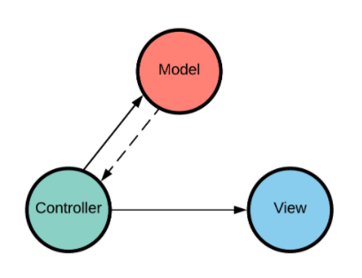

# Python REST APIs With Flask, Connexion, and SQLAlchemy

https://realpython.com/flask-connexion-rest-api/

## PART-1

### Connexion module
https://github.com/zalando/connexion

```bash
$ pip install connexion
```

This makes the **Connexion** module available to your program. The Connexion module allows a Python program to use the **Swagger** specification. This provides a lot of functionality: validation of input and output data to and from your API, an easy way to configure the API URL endpoints and the parameters expected, and a really nice UI interface to work with the created API and explore it.

All of this can happen when you create a configuration file your application can access. The Swagger site even provides an online configuration editor tool to help create and/or syntax check the configuration file you will create.


### Simplify API development
https://swagger.io/

*Note* 
remember to install `pip install connexion[swagger-ui]` in your virtual env

You’ve added a couple of things to incorporate Connexion into the server. The import connexion statement adds the module to the program. The next step is creating the application instance using Connexion rather than Flask. Internally, the Flask app is still created, but it now has additional functionality added to it.

Part of the app instance creation includes the parameter `specification_dir`. This informs Connexion what directory to look in for its configuration file, in this case our current directory. Right after this, you’ve added the line:

```py
app.add_api('swagger.yml')
```

### The Swagger Configuration File
The file swagger.yml is a YAML or JSON file containing all of the information necessary to configure your server to provide input parameter validation, output response data validation, URL endpoint definition, and the Swagger UI.
Here is the `swagger.yml` file defining the `GET /api/people` endpoint your REST API will provide ( see `swagger.yml`)

For the 
- consumes: tells Connexion what MIME type is expected by the API.
- produces: tells Connexion what content type is expected by the caller of the API.
see also  **MIME types (IANA media types)**
https://developer.mozilla.org/en-US/docs/Web/HTTP/Basics_of_HTTP/MIME_types

### The Swagger UI

Now you have a simple web API running with a single URL endpoint. At this point, it would be reasonable to think, “configuring this with the swagger.yml file was cool and all, but what did it get me?”

You’d be right to think that. We haven’t taken advantage of the input or output validation. All that `swagger.yml` gave us was a definition for the code path connected to the URL endpoint. However, what you also get for the extra work is the creation of the Swagger UI for your API.

If you navigate to `localhost:5000/api/ui`, the system will bring up a page that looks something like this: ...


### Building Out the Complete API

| Action	|   HTTP Verb	|   URL Path	|   Description |
| --------- |:-------------:| ------------: |  ------------:|
| Create	| POST	        | /api/people	        | Defines a unique URL to create a new person
| Read	    | GET	        | /api/people	        | Defines a unique URL to read a collection of people
| Read	    | GET	        | /api/people/Farrell	| Defines a unique URL to read a particular person in the people collection
| Update	| PUT	        | /api/people/Farrell	| Defines a unique URL to update an existing person
| Delete	| DELETE        | /api/people/Farrell	| Defines a unique URL to delete an existing person


To achieve this, you’ll extend both the `swagger.yml` and `people.py` files to fully support the API defined above. For the sake of brevity, only a link will be provided for both files:

swagger.yml
people.py

### Demonstration Single-Page Application

As was mentioned, the JavaScript file provides all the interaction with and updates to the web application. It does this by breaking up the necessary functionality into three parts by using the MVC (Model / View / Controller) design pattern.

Each object is created by a self-invoking function returning its own API for use by the other pieces. For instance, the Controller is passed the instances of the Model and View as parameters in its instantiation. It interacts with those objects through their exposed API methods.

The only other connection is between the Model and Controller by means of custom events on the AJAX method calls:

The Model provides the connection to the people API. Its own API is what the Controller calls to interact with the server when a user interaction event requires it.
The View provides the mechanism to update the web application DOM. Its own API is what the Controller calls to update the DOM when a user interaction event requires it.
The Controller provides all the event handlers for user interaction with the web application. This allows it to make calls to the Model to make requests to the people API, and to the View to update the DOM with new information received from the people API.
It also handles the custom events generated by the asynchronous AJAX requests made by the Model to the people API.

Here is a diagram of the MVC structure used in the `home.js` file:



The idea is that the Controller has a strong link to both the Model and the View. The Model has a weak link (the custom events) to the Controller and no connection to the View at all. The weak link from the Model to the Controller reduces coupling and dependence, which is useful in this case.


---

---

## PART-2
https://github.com/realpython/materials/tree/master/flask-connexion-rest-part-2

As some noted in the comments for Part 1, the PEOPLE structure is re-initialized every time the application is restarted. In this article, you’ll learn how to store the PEOPLE structure, and the actions the API provides, to a database using SQLAlchemy and Marshmallow.

**SQLAlchemy** provides an Object Relational Model (ORM)
https://www.sqlalchemy.org/
which stores Python objects to a database representation of the object’s data. That can help you continue to think in a Pythonic way and not be concerned with how the object data will be represented in a database

**marshmallow**: simplified object serialization
https://marshmallow.readthedocs.io/en/3.0/
Marshmallow provides functionality to serialize and deserialize Python objects as they flow out of and into our JSON-based REST API. 
Marshmallow converts Python class instances to objects that can be converted to JSON.

`pip install Flask-SQLAlchemy flask-marshmallow marshmallow-sqlalchemy marshmallow`

This adds more functionality to your virtualenv:

1. **Flask-SQLAlchemy** adds SQLAlchemy, along with some tie-ins to Flask, allowing programs to access databases.

2. **flask-marshmallow** adds the Flask parts of Marshmallow, which lets programs convert Python objects to and from serializable structures.

3. **marshmallow-sqlalchemy** adds some Marshmallow hooks into SQLAlchemy to allow programs to serialize and deserialize Python objects generated by SQLAlchemy.

4. **marshmallow** adds the bulk of the Marshmallow functionality.

https://www.sqlite.org/index.html
You’re going to use **SQLite** as the database engine to store the `PEOPLE` data. SQLite is the mostly widely distributed database in the world, and it comes with Python for free. It’s fast, performs all its work using files, and is suitable for a great many projects. It’s a complete RDBMS (Relational Database Management System) that includes SQL, the language of many database systems.

*JSON data type*
https://www.w3schools.com/js/js_json_datatypes.asp

### Database Interaction

```bash
sqlite3 people.db
```
A SQL query getting all of the data in our person table, sorted by last name, would look this this:

```SQL
SELECT * FROM person ORDER BY 'lname';
```
as reuslt :

```bash
sqlite> SELECT * FROM person ORDER BY 'lname';
1|Farrell|Doug|2020-05-18 14:41:49.945459
2|Brockman|Kent|2020-05-18 14:41:49.946286
3|Easter|Bunny|2020-05-18 14:41:49.946549
4|Rossi|Mario|2020-05-18 14:41:49.946765
```

Getting data this way isn’t very Pythonic. The list of records is okay, but each individual record is just a tuple of data. It’s up to the program to know the index of each field in order to retrieve a particular field. The following Python code uses SQLite to demonstrate how to run the above query and display the data:
see `show_db.py`

### Little Bobby Tables
In the above program, the SQL statement is a simple string passed directly to the database to execute. In this case, that’s not a problem because the SQL is a string literal completely under the control of the program. However, the use case for your REST API will take user input from the web application and use it to create SQL queries. This can open your application to attack.

You’ll recall from Part 1 that the REST API to get a single person from the PEOPLE data looked like this:

`GET /api/people/{lname}`

This means your API is expecting a variable, lname, in the URL endpoint path, which it uses to find a single person. Modifying the Python SQLite code from above to do this would look something like this:

```SQL
lname = 'Farrell'
cur.execute('SELECT * FROM person WHERE lname = \'{}\''.format(lname))
```

**!!!! NOTE !!!!**
https://en.wikipedia.org/wiki/SQL_injection
When this SQL is executed by the database, it searches the person table for a record where the last name is equal to 'Farrell'. This is what’s intended, but any program that accepts user input is also open to malicious users. In the program above, where the lname variable is set by user-supplied input, this opens your program to what’s called a SQL Injection Attack. This is what’s affectionately known as Little Bobby Tables:

You can protect your program by **sanitizing** all data you get from users of your application. Sanitizing data in this context means having your program examine the user-supplied data and making sure it doesn’t contain anything dangerous to the program. This can be tricky to do right and would have to be done everywhere user data interacts with the database.

**There’s another way that’s much easier: use SQLAlchemy.**
It will sanitize user data for you before creating SQL statements. It’s another big advantage and reason to use SQLAlchemy when working with databases.

### Modeling Data With SQLAlchemy
SQLAlchemy is a big project and provides a lot of functionality to work with databases using Python. One of the things it provides is an `ORM`, or `Object Relational Mapper`, and this is what you’re going to use to create and work with the person database table. This allows you to map a row of fields from the database table to a Python object.

Object Oriented Programming allows you to connect data together with behavior, the functions that operate on that data. By creating SQLAlchemy classes, you’re able to connect the fields from the database table rows to behavior, allowing you to interact with the data. Here’s the SQLAlchemy class definition for the data in the person database table:

see `models.py`
```py
class Person(db.Model):
    __tablename__ = 'person'
    person_id = db.Column(db.Integer, 
                          primary_key=True)
    lname = db.Column(db.String)
    fname = db.Column(db.String)
    timestamp = db.Column(db.DateTime, 
                          default=datetime.utcnow, 
                          onupdate=datetime.utcnow)

```

Where are you heading with this Person class definition? The end goal is to be able to run a query using SQLAlchemy and get back a list of instances of the Person class. As an example, let’s look at the previous SQL statement:

```SQL
SELECT * FROM people ORDER BY lname;
```

Show the same small example program from above, but now using SQLAlchemy:

```py
from models import Person

people = Person.query.order_by(Person.lname).all()
for person in people:
    print(f'{person.fname} {person.lname}')
```

### Serializing/Deserializing Modeled Data
Working with SQLAlchemy modeled data inside your programs is very convenient. It is especially convenient in programs that manipulate the data, perhaps making calculations or using it to create presentations on screen. Your application is a REST API essentially providing CRUD operations on the data, and as such it doesn’t perform much data manipulation.

The REST API works with JSON data, and here you can run into an issue with the SQLAlchemy model. Because the data returned by SQLAlchemy are Python class instances, Connexion can’t serialize these class instances to JSON formatted data. Remember from Part 1 that Connexion is the tool you used to design and configure the REST API using a YAML file, and connect Python methods to it.

In this context, serializing means converting Python objects, which can contain other Python objects and complex data types, into simpler data structures that can be parsed into JSON datatypes, which are listed here:

- string: a string type
- number: numbers supported by Python (integers, floats, longs)
- object: a JSON object, which is roughly equivalent to a Python dictionary
- array: roughly equivalent to a Python List
- boolean: represented in JSON as true or false, but in Python as True or False
- null: essentially a None in Python

As an example, your Person class contains a timestamp, which is a Python DateTime. There is no date/time definition in JSON, so the timestamp has to be converted to a string in order to exist in a JSON structure.

Your Person class is simple enough so getting the data attributes from it and creating a dictionary manually to return from our REST URL endpoints wouldn’t be very hard. In a more complex application with many larger SQLAlchemy models, this wouldn’t be the case. A better solution is to use a module called **Marshmallow** to do the work for you.

**Marshmallow** helps you to create a `PersonSchema` class, which is like the **SQLAlchemy** `Person` class we created. Here however, instead of mapping database tables and field names to the class and its attributes, the `PersonSchema` class defines how the attributes of a class will be converted into JSON-friendly formats. Here’s the Marshmallow class definition for the data in our person table:

```py
class PersonSchema(ma.ModelSchema):
    class Meta:
        model = Person
        sqla_session = db.session
```

### Create the Initialized Database

You’re going to create a new utility program called `build_database.py` to create and initialize the SQLite `people.db` database file containing your person database table. Along the way, you’ll create two Python modules, `config.py` and `models.py`, which will be used by `build_database.py` and the modified `server.py` from Part 1.

Here’s where you can find the source code for the modules you’re about to create, which are introduced here:

- `config.py` gets the necessary modules imported into the program and configured. 
  This includes Flask, Connexion, SQLAlchemy, and Marshmallow. Because it will be used by both build_database.py and server.py, some parts of the configuation will only apply to the server.py application.

- `models.py` is the module where you’ll create the Person SQLAlchemy and PersonSchema Marshmallow class definitions described above. This module is dependent on config.py for some of the objects created and configured there.

### Config Module
The `config.py` module, as the name implies, is where all of the configuration information is created and initialized. We’re going to use this module for both our `build_database.py` program file and the soon to be updated `server.py` file from the Part 1 article. This means we’re going to configure **Flask, Connexion, SQLAlchemy, and Marshmallow** here.

Even though the `build_database.py` program doesn’t make use of Flask, Connexion, or Marshmallow, it does use SQLAlchemy to create our connection to the SQLite database. Here is the code for the config.py module:

```py
import os
import connexion
from flask_sqlalchemy import SQLAlchemy
from flask_marshmallow import Marshmallow

# creates the variable basedir pointing to the directory the program is running in.
basedir = os.path.abspath(os.path.dirname(__file__))

# Create the Connexion application instance
# uses the basedir variable to create the Connexion app instance and give it the path to the swagger.yml file
connex_app = connexion.App(__name__, specification_dir=basedir)

# Get the underlying Flask app instance
app = connex_app.app

# Configure the SQLAlchemy part of the app instance
app.config['SQLALCHEMY_ECHO'] = True
app.config['SQLALCHEMY_DATABASE_URI'] = 'sqlite:////' + os.path.join(basedir, 'people.db')
app.config['SQLALCHEMY_TRACK_MODIFICATIONS'] = False

# Create the SQLAlchemy db instance
'''
creates the db variable by calling SQLAlchemy(app). This initializes SQLAlchemy by passing the app configuration information just set. The db variable is what’s imported into the build_database.py program to give it access to SQLAlchemy and the database. It will serve the same purpose in the server.py program and people.py module
'''
db = SQLAlchemy(app)

# Initialize Marshmallow
'''
creates the ma variable by calling Marshmallow(app). This initializes Marshmallow and allows it to introspect the SQLAlchemy components attached to the app. This is why Marshmallow is initialized after SQLAlchemy
'''
ma = Marshmallow(app)
```

### Models Module
The models.py module is created to provide the Person and PersonSchema classes exactly as described in the sections above about modeling and serializing the data. Here is the code for that module:
```py
from datetime import datetime
from config import db, ma

class Person(db.Model):
    __tablename__ = 'person'
    person_id = db.Column(db.Integer, primary_key=True)
    lname = db.Column(db.String(32), index=True)
    fname = db.Column(db.String(32))
    timestamp = db.Column(db.DateTime, default=datetime.utcnow, onupdate=datetime.utcnow)

class PersonSchema(ma.ModelSchema):
    class Meta:
        model = Person
        sqla_session = db.session    
```

### Creating the Database
You’ve seen how database tables can be mapped to SQLAlchemy classes. Now use what you’ve learned to create the database and populate it with data. You’re going to build a small utility program to create and build the database with the People data. Here’s the build_database.py program: see `build_database.py`


### Using the Database

Once the database has been created, you can modify the existing code from Part 1 to make use of it. All of the modifications necessary are due to creating the `person_id` primary key value in our database as the unique identifier rather than the `lname` value.

### Update the REST API - `swagger.yml`
None of the changes are very dramatic, and you’ll start by re-defining the REST API. The list below shows the API definition from Part 1 but is updated to use the person_id variable in the URL path:

| Action	|   HTTP Verb	|   URL Path	            |   Description |
| --------- |:-------------:| ------------:             |  ------------:|
| Create	| POST	        | /api/people	            | Defines a unique URL to create a new person
| Read	    | GET	        | /api/people	            | Defines a unique URL to read a collection of people
| Read	    | GET	        | /api/people/{person_id}	| Defines a unique URL to read a particular person by person_id
| Update	| PUT	        | /api/people/{person_id}	| Defines a unique URL to update an existing person by person_id
| Delete	| DELETE        | /api/people/{person_id}	| Defines a unique URL to delete an existing person by person_id

Where the URL definitions required an `lname` value, they now require the `person_id` (primary key) for the person record in the people table. This allows you to remove the code in the previous app that artificially restricted users from editing a person’s last name.

In order for you to implement these changes, the `swagger.yml` file from Part 1 will have to be edited. For the most part, any `lname` parameter value will be changed to `person_id`, and `person_id` will be added to the `POST` and `PUT`responses. You can check out the updated `swagger.yml` file.

### Update the REST API Handlers - `people.py`
With the `swagger.yml` file updated to support the use of the person_id identifier, you’ll also need to update the handlers in the people.py file to support these changes. 
In the same way that the `swagger.yml` file was updated, you need to change the `people.py` file to use the `person_id` value rather than `lname`.

Here’s part of the updated `person.py` module showing the handler for the REST URL endpoint `GET /api/people`:

```py
from flask import (
    make_response,
    abort,
)
from config import db
from models import (
    Person,
    PersonSchema,
)

def read_all():
    """
    This function responds to a request for /api/people
    with the complete lists of people

    :return:        json string of list of people
    """
    # Create the list of people from our data
    people = Person.query.order_by(Person.lname).all()

    # Serialize the data for the response
    person_schema = PersonSchema(many=True)
    return person_schema.dump(people).data
```

Here’s another part of the person.py module that makes a request for a single person from the person database. Here, read_one(person_id) function receives a person_id from the REST URL path, indicating the user is looking for a specific person. Here’s part of the updated person.py module showing the handler for the REST URL endpoint `GET /api/people/{person_id}`:
```py
def read_one(person_id):
    """
    This function responds to a request for /api/people/{person_id}
    with one matching person from people

    :param person_id:   ID of person to find
    :return:            person matching ID
    """
    # Get the person requested
    person = Person.query \
        .filter(Person.person_id == person_id) \
        .one_or_none()

    # Did we find a person?
    if person is not None:

        # Serialize the data for the response
        person_schema = PersonSchema()
        return person_schema.dump(person).data

    # Otherwise, nope, didn't find that person
    else:
        abort(404, 'Person not found for Id: {person_id}'.format(person_id=person_id))
```


Another modification to `person.py` is creating a **new person in the database**. This gives you an opportunity to use the Marshmallow PersonSchema to deserialize a JSON structure sent with the HTTP request to create a SQLAlchemy Person object. Here’s part of the updated person.py module showing the handler for the REST URL endpoint `POST /api/people`:

```py
def create(person):
    """
    This function creates a new person in the people structure
    based on the passed-in person data

    :param person:  person to create in people structure
    :return:        201 on success, 406 on person exists
    """
    fname = person.get('fname')
    lname = person.get('lname')

    existing_person = Person.query \
        .filter(Person.fname == fname) \
        .filter(Person.lname == lname) \
        .one_or_none()

    # Can we insert this person?
    if existing_person is None:

        # Create a person instance using the schema and the passed-in person
        schema = PersonSchema()
        new_person = schema.load(person, session=db.session).data

        # Add the person to the database
        db.session.add(new_person)
        db.session.commit()

        # Serialize and return the newly created person in the response
        return schema.dump(new_person).data, 201

    # Otherwise, nope, person exists already
    else:
        abort(409, f'Person {fname} {lname} exists already')


```


## PART-3
https://github.com/realpython/materials/tree/master/flask-connexion-rest-part-3

In Part 2 of this series, you added the ability to save changes made through the REST API to a database using SQLAlchemy and learned how to serialize that data for the REST API using Marshmallow. Connecting the REST API to a database so that the application can make changes to existing data and create new data is great and makes the application much more useful and robust.

That’s only part of the power a database offers, however. An even more powerful feature is the `R` part of `RDBMS systems`: `relationships`. In a database, a relationship is the ability to connect two or more tables together in a meaningful way. In this article, you’ll learn how to implement relationships and turn your Person database into a mini-blogging web application.

### Who This Article Is For
- Part 1 of this series guided you through building a REST API, and 
- Part 2 showed you how to connect that REST API to a database.

This article expands your programming tool belt further. You’ll learn how to create hierarchical data structures represented as `one-to-many` relationships by SQLAlchemy. In addition, you’ll extend the REST API you’ve already built to provide CRUD (Create, Read, Update, and Delete) support for the elements in this hierarchical structure.

The web application presented in Part 2 will have its HTML and JavaScript files modified in major ways to create a more fully functional mini-blogging application. You can review the final version of the code from Part 2 in the GitHub repository for that article.

### Additional Dependencies
There are no new Python dependencies beyond what was required for the Part 2 article. However, you will be using two new JavaScript modules in the web application to makes things easier and more consistent. The two modules are the following:

1. Handlebars.js is a templating engine for JavaScript, much like Jinja2 for Flask.
2. Moment.js is a datetime parsing and formatting module that makes displaying UTC timestamps easier.

You don’t have to download either of these, as the web application will get them directly from the Cloudflare CDN (Content Delivery Network), as you’re already doing for the jQuery module.

### People Data Extended for Blogging
In Part 2, the People data existed as a dictionary in the build_database.py Python code. This is what you used to populate the database with some initial data. You’re going to modify the People data structure to give each person a list of notes associated with them. The new People data structure will look like this:
```py
# Data to initialize database with
PEOPLE = [
    {
        "fname": "Doug",
        "lname": "Farrell",
        "notes": [
            ("Cool, a mini-blogging application!", "2019-01-06 22:17:54"),
            ("This could be useful", "2019-01-08 22:17:54"),
            ("Well, sort of useful", "2019-03-06 22:17:54"),
        ],
    },
    {
        "fname": "Kent",
        "lname": "Brockman",
        "notes": [
            (
                "I'm going to make really profound observations",
                "2019-01-07 22:17:54",
            ),
            (
                "Maybe they'll be more obvious than I thought",
                "2019-02-06 22:17:54",
            ),
        ],
    },
    {
        "fname": "Bunny",
        "lname": "Easter",
        "notes": [
            ("Has anyone seen my Easter eggs?", "2019-01-07 22:47:54"),
            ("I'm really late delivering these!", "2019-04-06 22:17:54"),
        ],
    },
]
```

Each person in the People dictionary now includes a key called notes, which is associated with a list containing tuples of data. Each tuple in the notes list represents a single note containing the content and a timestamp. The timestamps are initialized (rather than dynamically created) to demonstrate ordering later on in the REST API.

Each single person is associated with multiple notes, and each single note is associated with only one person. This hierarchy of data is known as a one-to-many relationship, where a single parent object is related to many child objects. You’ll see how this one-to-many relationship is managed in the database with SQLAlchemy.

### Initialize the Database

You can see that working with the notes collection in the Person object instance p is just like working with any other list in Python. `SQLAlchemy` takes care of the underlying one-to-many relationship information when the db.session.commit() call is made.

For example, just like a Person instance has its primary key field person_id initialized by SQLAlchemy when it’s committed to the database, instances of Note will have their primary key fields initialized. In addition, the Note foreign key person_id will also be initialized with the primary key value of the Person instance it’s associated with.

Here’s an example instance of a Person object before the db.session.commit() in a kind of pseudocode:

```py
Person (
    person_id = None
    lname = 'Farrell'
    fname = 'Doug'
    timestamp = None
    notes = [
        Note (
            note_id = None
            person_id = None
            content = 'Cool, a mini-blogging application!'
            timestamp = '2019-01-06 22:17:54'
        ),
        Note (
            note_id = None
            person_id = None
            content = 'This could be useful'
            timestamp = '2019-01-08 22:17:54'
        ),
        Note (
            note_id = None
            person_id = None
            content = 'Well, sort of useful'
            timestamp = '2019-03-06 22:17:54'
        )
    ]
)
```

Here’s the example Person object after the `db.session.commit()`:

```py
Person (
    person_id = 1
    lname = 'Farrell'
    fname = 'Doug'
    timestamp = '2019-02-02 21:27:10.336'
    notes = [
        Note (
            note_id = 1
            person_id = 1
            content = 'Cool, a mini-blogging application!'
            timestamp = '2019-01-06 22:17:54'
        ),
        Note (
            note_id = 2
            person_id = 1
            content = 'This could be useful'
            timestamp = '2019-01-08 22:17:54'
        ),
        Note (
            note_id = 3
            person_id = 1
            content = 'Well, sort of useful'
            timestamp = '2019-03-06 22:17:54'
        )
    ]
)
```

The important difference between the two is that the primary key of the Person and Note objects has been initialized. The database engine took care of this as the objects were created because of the auto-incrementing feature of primary keys discussed in Part 2.

Additionally, the person_id foreign key in all the Note instances has been initialized to reference its parent. This happens because of the order in which the Person and Note objects are created in the database.

SQLAlchemy is aware of the relationship between Person and Note objects. When a Person object is committed to the person database table, SQLAlchemy gets the person_id primary key value. That value is used to initialize the foreign key value of person_id in a Note object before it’s committed to the database.

SQLAlchemy takes care of this database housekeeping work because of the information you passed when the Person.notes attribute was initialized with the db.relationship(...) object.

In addition, the Person.timestamp attribute has been initialized with the current timestamp.

Running the build_database.py program from the command line (in the virtual environment will re-create the database with the new additions, getting it ready for use with the web application. This command line will rebuild the database:

```bash
$ python build_database.py
```

### Update REST API
You’ve updated the SQLAlchemy models and used them to update the people.db database. Now it’s time to update the REST API to provide access to the new notes information. Here’s the REST API you built in Part 2:

| Action    |   HTTP Verb   |   URL Path                 |   Description |
| --------- |:-------------:| ------------:              |  ------------:|
| Create	POST	         |   /api/people	         |  URL to create a new person                        |
| Read	    GET	             |   /api/people	         |  URL to read a collection of people                | 
| Read	    GET	             |   /api/people/{person_id} |	URL to read a single person by person_id          |
| Update	PUT	             |   /api/people/{person_id} |	URL to update an existing person by person_id     |
| Delete	DELETE	         |   /api/people/{person_id} |	URL to delete an existing person by person_id     |

The REST API above provides HTTP URL paths to collections of things, and to the things themselves. You can get a list of people or interact with a single person from that list of people. This path style refines what’s returned in a left-to-right manner, getting more granular as you go.

You’ll continue this left-to-right pattern to get more granular and access the notes collections. Here’s the extended REST API you’ll create in order to provide notes to the mini-blog web application:

| Action    |   HTTP Verb   |   URL Path                                |   Description |
| --------- |:-------------:| ------------:                             |  ------------:|
|Create	    | POST	        | /api/people/{person_id}/notes	            | URL to create a new note                                      |
|Read	    | GET	        | /api/people/{person_id}/notes/{note_id}	| URL to read a single person’s single note                     |
|Update	    | PUT	        | /api/people/{person_id}/notes/{note_id}	| URL to update a single person’s single note                   |
|Delete	    | DELETE	    | /api/people/{person_id}/notes/{note_id}	| URL to delete a single person’s single note                   |
|Read	    | GET	        | /api/notes	                            | URL to get all notes for all people sorted by note.timestamp  |


### Implement the API
With the updated REST API defined in the `swagger.yml` file, you’ll need to update the implementation provided by the Python modules. 
This means updating existing module files, like `models.py` and `people.py`, and creating a new module file called `notes.py` to implement support for Notes in the extended REST API.